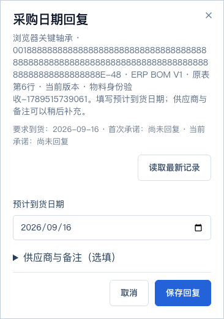
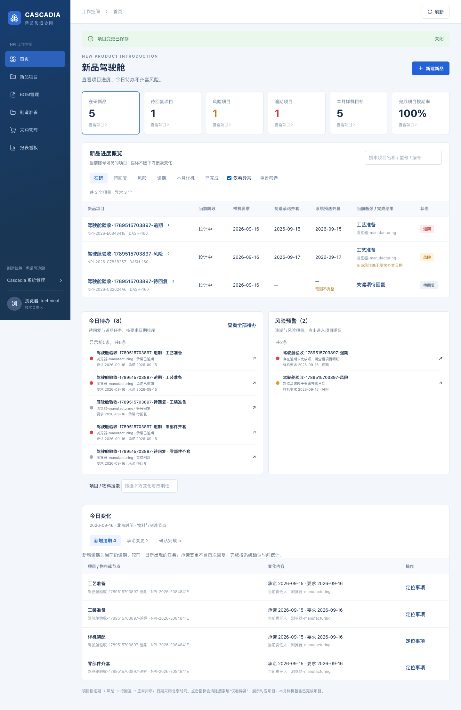
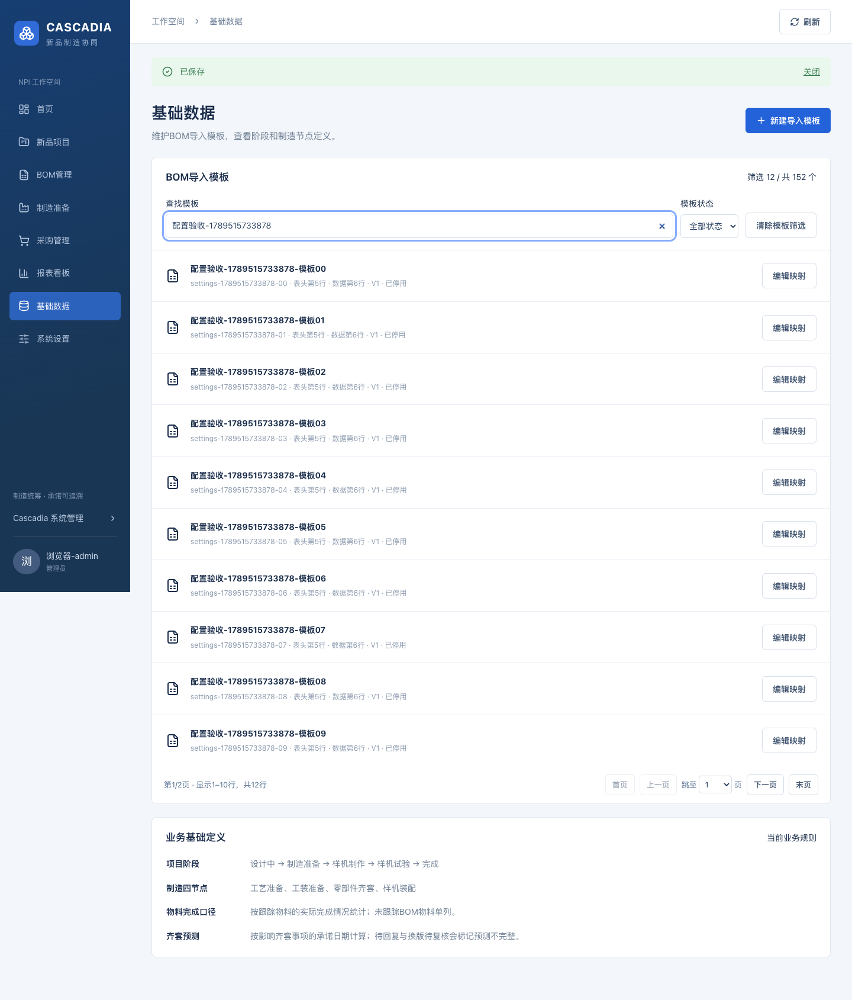

# V1 当前完整回归与采购识别修复

2026-09-16，用户明确允许完整接口、桌面／手机回归以及独立测试库保留合成诊断数据后执行。修复前候选、修复后候选和实际交付的记录分开保存；本页是开发回归记录，真实业务签收另行进行。

## 结果

- 当前完整 HTTP 套件：37 项通过，0 失败、0 跳过，包含主管仅计划调整及权限隔离。
- 修复后的候选与同步后的实际构建均完成整套桌面／手机浏览器流程。实际日志包含 31 条场景完成标记，不与单元测试数量混算。
- 两份真实 ERP 样本分别 47／56 行、16／23 个一级件、4 层；实际界面导入及原件下载字节核对通过。
- 5000 行、8 层合成 BOM 的导入、预览／树分页、搜索、深层跟踪、手机显示和原件下载通过。
- 5 项采购保存／到货组件回归、修改文件 lint、core／app／根脚本类型检查和候选／实际完整构建通过。
- 3410 实际界面已加载修复，3411 未登录接口仍返回 401。

## 修复与测试适配

完整回归发现采购日期回复弹窗在此前简化时丢失物料编码和 BOM 来源行。同名物料仅凭名称无法核对，本次恢复编码、版本、原表行和当前／历史版本标记；采购回复与到货共用此显示。首次回复仍只需填写日期。长编码手机换行及同名同编码不同来源行的准确回复、历史追踪均通过。

回归脚本同时适配当前八模块导航、主管对已完成项目的锁定及制造并发修改的显式核对步骤。标准 ERP 样本明确选择默认模板，避免测试库中保留的同格式模板造成自动匹配歧义；自定义数值层级模板仍完整验证。全部业务断言保留或改为当前更严格的行为。

## 界面记录

## 数据与范围

测试强制使用显式配置的独立 _test 数据库，浏览器资料使用 /tmp 下独立 Vault。按本次授权保留诊断记录和资料，不向正式业务库写入测试项目。两份真实 ERP 文件仅用于测试项目导入，原文件不改写。测试临时服务结束，未发送外部通知。

需求对应关系见[规格书对照](srs-traceability.md)，日志哈希、样本和实际运行核查见[结构化证据](full-regression-verification.json)。此前专项与构建证据保留原日期；本页替代“完整回归待允许／待执行”的旧状态。SRS18 推荐的真实项目试运行、企业规模压力验收及 P2 扩展仍按各自范围处理。
